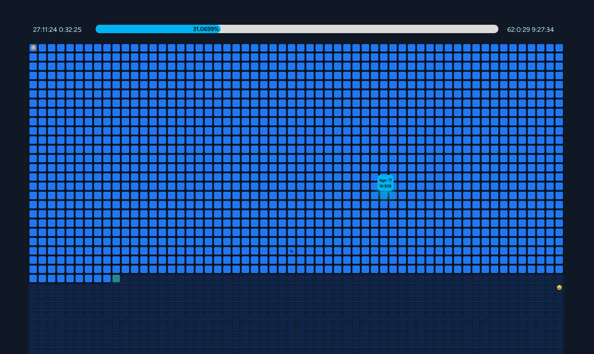

# Always Forward

## A Planner For Your Entire Life

### The Plan
I believe I have tried every variation of time management tool and have never been perfectly satisfied with any of them at a macro scale. I think Toggl has the best time manager for micro, hourly time management but none of the bigger picture, macro time management tool seem to satisfy me at a personal level.

This is my attempt to solve that problem for myself, forever, and maybe yours too.

### The Philosophy
This planner and task organizer is the conclusion of the following thought-process:

1. You should constantly remember you are going to die.
2. How can I know exactly how much time I have left on this Earth and be able to budget it accordingly?
3. A human lifespan can be broken down into just under 5000 weeks.
4. Each week can receive a kanban board, and I can apply some of the same principles in business time management with life management.

## Your Life in Weeks
I have one of these "Your Life in Weeks" posters hanging in my room, and I always liked the idea. I tried integrating the already built [React Life Calendar](https://github.com/ngduc/life-calendar), but I decided to write my own so I didn't have to use the chakra libraries used in that project. I shamelessly stole some of the very good ideas from that project, such as the emojis on certain blocks to signify important life events. My version only uses Tailwind, and is only 2 jsx files with a css stylesheet. I am thinking about making that its own repo. 

### Other Considerations
- Integrations with Toggl, which I like for hourly time management.