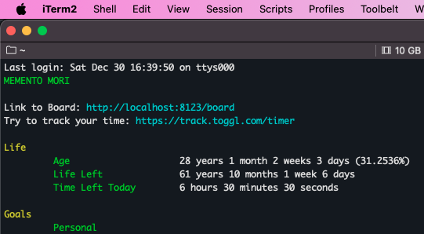

# Always Forward

## A Planner For Your Entire Life


### The Plan
I believe I have tried every variation of time management tool and have never been perfectly satisfied with any of them at a macro scale. I think [Toggl](https://track.toggl.com/) has the best time manager for micro, hourly time management but none of the bigger picture, macro time management tool seem to satisfy me at a personal level.

This is my attempt to solve that problem for myself, forever, and maybe yours too.

### The Philosophy
This planner and task organizer is the conclusion of the following thought-process:

1. You should constantly remember you are going to die.
2. How can I know exactly how much time I have left on this Earth and be able to budget it accordingly?
3. A human lifespan can be broken down into just under 5000 weeks.
4. Each week can receive a kanban board, and I can apply some of the same principles in business time management with life management.

## Me First, and Therefore, Developers First
I am making this application for me first. All considerations around this application are personal, and only coincidentally may align with the values of others. Since I am a developer, and I inherently try to write code that other developers will also understand and like, other developers should also enjoy this. 

I am in the process of building out a CLI for the platform. I did have one up and running in the past, but it felt too half-baked. I am rethinking this. There are life stats you can print to the terminal.

If you encounter issues, I apologize, but it works on my machine. Feel free to add issues, and I will attempt to fix them. 



## Your Life in Weeks
I have one of these "Your Life in Weeks" posters hanging in my room, and I always liked the idea. 

I tried integrating the already built [React Life Calendar](https://github.com/ngduc/life-calendar), but I instead opted to just stealing some of the really good ideas from that library and writing my own version of it. My version only uses Tailwind, and is only 2 jsx files with a css stylesheet. I am thinking about making that its own repo. I do appreciate the author ngduc for creating it. 

My version creates a progress bar of your life at the top. Each block in the life-weeks chart is clickable, and provides links to a Kanban board of that week, or even link you to Toggl at that date, if you have a Toggl account. 


## Desktop Application


Contained in the `./desktop` folder is an Electron wrapper for running Always Forward as a desktop application. The way it works is pretty cool:

- It checks the `desktop/app_url` file for wherever you plan on hosting the app
- If the app_url is set to a `localhost`, it will:
  - Automatically download the correct PHP binary for your machine, (*Unix only; see `desktop/scripts/install_php.cpp` for more details*)
  - Create a copy of the Laravel application in the `desktop/laravel` folder 
  - Build electron with both the PHP binary and the AlwaysForward Laravel application
  - Automatically start the PHP server everytime you start the Electron application
  - For more details here, check `desktop/scripts/build` and the first 30 lines of `desktop/main.js`

- If the app_url is set to something other than localhost, it will:
  - Build a plain Electron app and simply point to that url


So this allows you to run the app locally, or if you'd prefer to self-host this on a server somewhere centralized, you could also point the desktop app to that external server. 

### Quick Start
To set this up, simply:
1. Set the `desktop/app_url` to your preferred host, (*by default it's `localhost:8124`*)
2. Run `cd ./desktop ; yarn build`

Then check the `./desktop/out` directory for the files
On MacOS, you can package the application into a desktop app by simply running `cd ./desktop ; yarn build` and then clicking the `.dmg` file it creates in the `./desktop/out` directory. 

I think it ends up looking quite nice on Mac.


## Set up on your machine

### Laravel configuration
For more information on initial Laravel setup, see [Laravel Docs](https://laravel.com/docs/10.x/installation). They're probably the best docs on the internet.

#### Necessary Laravel Commands
Copy .env.example to .env
```bash
cp .env.example .env
```

Add personal env values to .env
```bash
APP_URL=http://localhost
APP_PORT=8124
APP_TIMEZONE="America/Chicago"
```

Install composer packages
```bash
composer install
```

Install Node Packages
```bash
yarn
```

DB Setup
```bash
# Run migrations
php artisan migrate

# Run seeds
php artisan db:seed
```