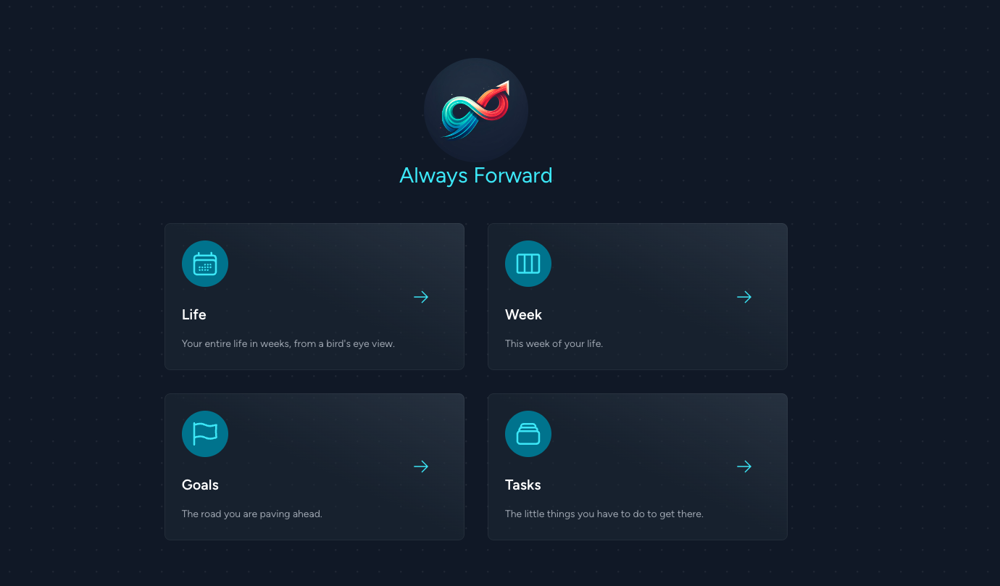

# Always Forward

## A Planner For Your Entire Life

### The Plan
I believe I have tried every variation of time management tool and have never been perfectly satisfied with any of them at a macro scale. I think [Toggl](https://track.toggl.com/) has the best time manager for micro, hourly time management but none of the bigger picture, macro time management tool seem to satisfy me at a personal level.

This is my attempt to solve that problem for myself, forever, and maybe yours too.

### The Philosophy
This planner and task organizer is the conclusion of the following thought-process:

1. You should constantly remember you are going to die.
2. How can I know exactly how much time I have left on this Earth and be able to budget it accordingly?
3. A human lifespan can be broken down into just under 5000 weeks.
4. Each week can receive a kanban board, and I can apply some of the same principles in business time management with life management.

## Me First, and Therefore, Developers First
I am making this application for me first. All considerations around this application are personal, and only coincidentally may align with the values of others. Since I am a developer, and I inherently try to write code that other developers will also understand and like, other developers should also enjoy this. That is why it will also come with a CLI for handling models and printing out useful task information. I have plans to build an API around it as well.

If you encounter issues, I apologize, but it works on my machine. Feel free to add issues, and I will attempt to fix them. 

## Your Life in Weeks
I have one of these "Your Life in Weeks" posters hanging in my room, and I always liked the idea. 

I tried integrating the already built [React Life Calendar](https://github.com/ngduc/life-calendar), but I instead opted to just stealing some of the really good ideas from that library and writing my own version of it. My version only uses Tailwind, and is only 2 jsx files with a css stylesheet. I am thinking about making that its own repo. I do appreciate the author ngduc for creating it. 

My version creates a progress bar of your life at the top. Each block in the life-weeks chart is clickable, and provides links to a Kanban board of that week, or even link you to Toggl at that date, if you have a Toggl account. 

## Desktop Application

Contained in the `./desktop` folder is an Electron wrapper for running Always Forward as a desktop application. 

Currently, the only non-stupid way of combining ElectronJS and Laravel is by simply creating an Electron wrapper and opening the url to your Laravel app. I don't care what anyone says, packaging PHP binaries into your Electron application just to start a php server is stupid, and also never works as expected. You're really better off just rewriting your whole app in Javascript. 

I keep the app running locally on my computer using [supervisor](http://supervisord.org/), which is a fairly standard way of running background processes. It's even the recommended program for running Laravel Jobs.

On MacOS, you can package the application into a desktop app by simply running `cd ./desktop ; yarn build` and then clicking the `.dmg` file it creates in the `./desktop/out` directory. 

I think it looks quite nice.

